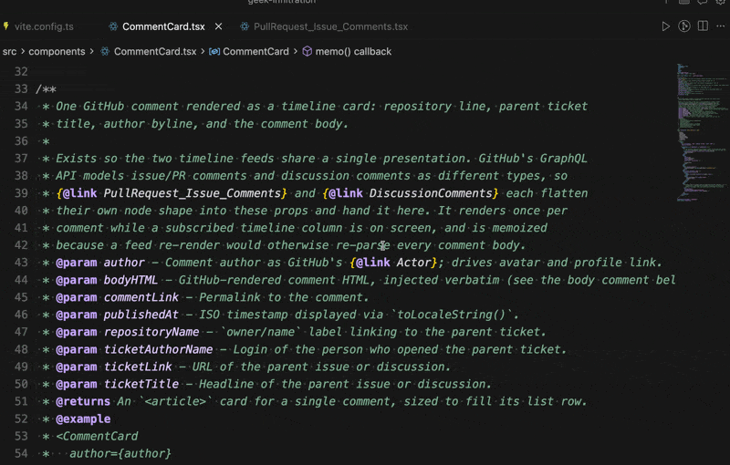

# Go To Definition for JSDoc

Go To Definition for JSDoc makes inline documentation links jump to TypeScript workspace symbols even when the current file does not import the symbol.

## Why This Exists

This extension is a practical solution to the frustration described in [microsoft/TypeScript#47718 — Provide way to link to other files from JSDoc comments](https://github.com/microsoft/TypeScript/issues/47718): make symbol-name JSDoc links work with Go to Definition today, without adding throwaway imports just for navigation.

It focuses on the everyday symbol-navigation case rather than replacing native relative-file links or TypeScript protocol support.

## Install

- [VS Code Marketplace](https://marketplace.visualstudio.com/items?itemName=laststance.go-to-definition-for-jsdoc)
- [Open VSX Registry](https://open-vsx.org/extension/laststance/go-to-definition-for-jsdoc)

## Features

- Jump from JSDoc inline links to workspace TypeScript symbols.
- Supports unimported symbols such as `{@link 'useReadableDrawingItemSettingsQuery'}`.
- Falls back to a TypeScript AST scan when VS Code's workspace symbol provider has no result.

## Demo

[](./media/demo.mp4)

[Watch the MP4 demo](./media/demo.mp4)

## Usage

```ts
/**
 * Reads drawing settings from the shared query.
 * See {@link 'useReadableDrawingItemSettingsQuery'}.
 */
```

Place the cursor inside the link target and run VS Code's Go to Definition command.

## Supported Links

- `{@link SymbolName}`
- `{@link 'SymbolName'}`
- `{@link "SymbolName"}`
- `{@link Namespace.SymbolName}`
- `{@linkplain SymbolName}`
- `{@linkcode SymbolName}`

## How It Resolves

1. Ask VS Code's workspace symbol provider for the exact symbol.
2. If nothing is found, scan TypeScript and JavaScript files with the TypeScript AST.

The fallback skips common generated and dependency directories such as `node_modules`, `dist`, `out`, `.next`, and `.git`.

## Development

```sh
pnpm install
pnpm validate
pnpm run package
```

To try the extension locally, open this folder in VS Code and run the `Run Go To Definition Extension` launch configuration.

## Publishing

```sh
pnpm run package
pnpm run publish:stores
```

Publishing reads `VSCE_PAT` and `OVSX_PAT` from 1Password through `.env.1password`.
